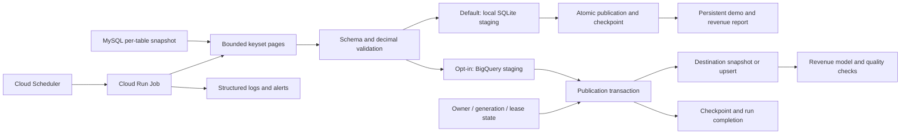
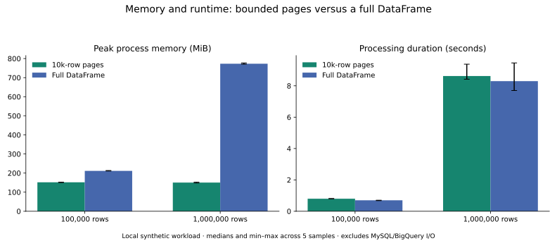

# MySQL → BigQuery: recoverable commerce ingestion

[](https://github.com/abouguri/mysql-bigquery-etl/actions/workflows/ci.yml)

A Python batch pipeline that stages and validates MySQL commerce data before publishing it to BigQuery. It combines bounded extraction, explicit data contracts, transactional publication, writer fencing and reconciliation with a reproducible local test/benchmark environment.

**Status: locally validated preview, $0 operating budget.** The default backend is SQLite; the demo uses disposable MySQL and makes no cloud calls. The local suite has 68 passing tests; five real-BigQuery integration tests remain unexecuted. Terraform validates, but cloud deployment, live concurrency guarantees, alerts and billing have not been verified. See [open gates](docs/backlog.md).

## Why this project exists

Scheduled ingestion is easy to demonstrate when nothing fails. The interesting problems are a load that succeeds before its acknowledgement arrives, concurrent workers, mutable source records, partial snapshots and memory growth. This project makes those failure paths and tradeoffs explicit rather than treating a successful load log as proof of correctness.

The demo uses users, single-product orders and products. Its analytics output is daily USD revenue by current product category. [Business definitions and reconciliation](docs/analytics.md) state the grain, refund policy and limitations.

## Architecture



- **Normal ingestion:** users/orders read a fixed `updated_at` window with a configurable 24-hour lookback. Keyset pages cover the window inside a consistent MySQL snapshot. Products use complete snapshots.
- **Publication:** staged pages load under stable job IDs. One BigQuery transaction checks and mutates writer ownership, validates staged keys/counts, publishes the target change, advances progress and records success.
- **Reconciliation:** complete per-table snapshots repair hard deletes and changes outside the lookback. Empty valid snapshots intentionally clear the destination.
- **Replay:** current source rows in a selected time range are upserted without advancing the live watermark. Older source timestamps cannot overwrite newer target timestamps.
- **Operations:** separate ingestion/reconciliation Cloud Run Jobs, private source networking, verified MySQL TLS, scoped IAM, pinned image/secret versions and paused-by-default schedules are defined in Terraform.

The fencing and transaction guarantees are **designs implemented in code, awaiting live BigQuery validation**. Local client tests cannot prove distributed behavior.

## Run the $0 demo

```sh
make demo           # extract MySQL fixtures and publish into local SQLite
make demo-report    # inspect counts, revenue, checkpoints and run history
make demo           # repeat safely
```

Expected: two users, two products, three orders, **309.85 USD**. Docker is required. Images/packages need an initial download; the runtime network is internal. The warehouse persists under ignored `local/`. See [demo instructions and backend tradeoffs](docs/local-demo.md).

## Run local tests

Prerequisites: Docker and Docker Compose. No cloud credentials are required.

```sh
make test            # offline unit/failure tests; MySQL/cloud cases skip
make integration     # seeded disposable MySQL plus the full local suite
make clean-fixtures  # remove synthetic fixture containers/data
```

The fixture contains two users, two products and three orders totaling **309.85 USD**. MySQL binds only to `127.0.0.1:3307`; set `MYSQL_TEST_PORT` if needed. Its data lives in tmpfs and is intentionally discarded on teardown. Local fixture credentials are not production credentials.

Native development uses Python **3.11.16**:

```sh
python -m venv .venv
. .venv/bin/activate
pip install -r requirements-dev.txt
python -m pytest -q
```

`requirements.in` files describe dependencies; `make lock` regenerates exact transitive pins. The container base is pinned by digest. CI runs static checks, offline tests, MySQL integration and Terraform validation without cloud credentials.

## Run against an approved cloud sandbox

Copy `.env.example` to `.env`, set the sandbox project/source connection and authenticate with Application Default Credentials. Do not commit credentials. For the Compose source, keep `docker compose up -d mysql` running before using the host CLI.

```sh
ETL_ALLOW_CLOUD=1 python main.py --backend bigquery
ETL_ALLOW_CLOUD=1 python main.py --backend bigquery --reconcile
ETL_ALLOW_CLOUD=1 python main.py --backend bigquery --table orders \
  --replay-from 2026-01-01T00:00:00Z \
  --replay-until 2026-01-02T00:00:00Z
```

These commands create/query/load BigQuery data and incur cloud usage. Select a sandbox and spend limit first. Existing warehouse tables need a deliberate schema/data migration: incompatible schemas and duplicate target keys fail closed. State uses `etl_state_v2` and `etl_runs_v2`; legacy state is not silently migrated.

[Deployment instructions](docs/runbooks/deployment.md) cover Terraform bootstrap, secrets, VPC/TLS, image builds, manual validation, rollback and teardown. [Recovery instructions](docs/runbooks/recovery.md) explain unknown job outcomes and lease expiry. The legacy `server.py` invokes the CLI and no longer exposes HTTP execution.

## Measured local evidence

**Real MySQL extraction:** at one million rows, 10k-row pages used **177.70 MiB median peak worker RSS**, versus **872.41 MiB** for full-size pages: **79.6% less worker memory**. Median extraction/processing time was **26.229s versus 22.939s** across three fresh-process samples per mode. This includes MySQL reads, transformation and validation; it excludes destination writes and MySQL server memory. [Raw samples, resource limits and methodology](benchmarks/results/mysql-summary.md). Reproduce with `make benchmark-mysql`.

**Crash recovery:** separate workers terminate abruptly after staging, before commit and after commit; tests check durable data/checkpoint consistency, retry identity and competing ownership. [Measured recovery evidence](docs/evidence/local-recovery.md). Reproduce with `make recovery-demo`.

**Processing-only comparison:**

At one million synthetic rows, 10,000-row pages used **150.32 MiB median peak process RSS**, versus **772.95 MiB** for a full DataFrame running the same transforms/contracts: **80.6% less memory**, with **3.9% greater median processing time**. Five fresh-process samples per configuration ran under two CPUs and 2 GiB container memory.



These numbers measure generation, transformation, validation and reconciliation in Python. They exclude MySQL and BigQuery I/O and do not establish end-to-end throughput, original-code speedup, production capacity or cloud cost. [Methodology](benchmarks/README.md), [raw samples](benchmarks/results/local.csv), [summary](benchmarks/results/summary.md) and source hashes are included.

## Guarantees and limits

| Area | Implemented behavior / boundary |
|---|---|
| Retry identity | Resolve the same operation job ID after uncertain acknowledgement; no fresh ID invented on retry |
| Publication | SQLite data/checkpoint atomicity verified with process-crash tests; live BigQuery verification pending |
| Source consistency | Consistent per-table InnoDB snapshots; no cross-table snapshot guarantee |
| Change capture | Source-maintained UTC timestamps plus lookback; arbitrary late commits require reconciliation |
| Deletes | Full reconciliation repairs current state; no historical delete/event stream |
| Memory | Runtime pages source/staging data; local processing benchmark measured separately from network I/O |
| Data quality | Explicit required schemas, exact decimal money, unique keys; reject the batch on invalid data |
| Concurrency (SQLite) | One database writer; 30-second table leases renew after each staged page; expired owners fail closed |
| Concurrency (BigQuery) | Fixed 30-minute lease; no heartbeat. Jobs have a 25-minute timeout; stale publication must fail |
| Retention | Staging expires after one day; target/state/audit retention requires an operator policy |
| Business model | One product per order, USD, UTC, current categories; no multi-line carts, SCD history or FX |

Do not describe this as end-to-end exactly-once delivery or production-proven reliability. Holding a source snapshot while staging bounds memory but can increase MySQL undo retention; measure that before scaling.

## Explore and present it

- [HTML roadmap and current progress](docs/portfolio-roadmap.html)
- [Implementation backlog](docs/backlog.md) and [validation history](docs/evidence/baseline.md)
- [Five-minute demo](docs/demo.md) and [case study / CV wording](docs/case-study.md)
- [Local incident writeup](docs/evidence/readiness-incident.md)
- [Analytics SQL](sql/revenue_daily.sql), [quality checks](sql/quality_checks.sql) and [cloud cost worksheet](docs/evidence/cost-template.csv)

Architecture discussion notes are maintained locally in the ignored `docs/architecture-decisions.md` companion. The public runbooks, evidence and case study document the implemented tradeoffs.

## License

[MIT](LICENSE).
